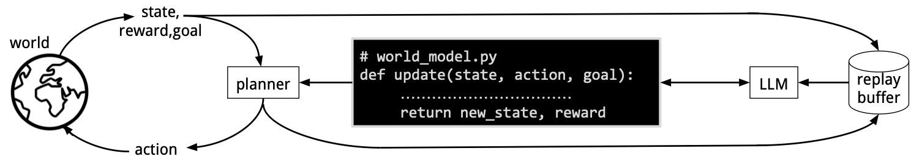
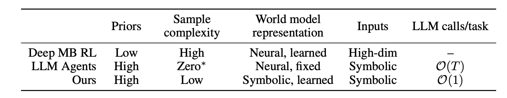

# WorldCoder, a Model-Based LLM Agent: Building World Models by Writing Code and Interacting with the Environment

This is the official codebase of the paper

[WorldCoder, a Model-Based LLM Agent: Building World Models by Writing Code and Interacting with the Environment](https://arxiv.org/pdf/2402.12275)\
[Hao Tang](https://haotang1995.github.io/), [Darren Key](https://darrenkey.github.io/), and [Kevin Ellis](https://www.cs.cornell.edu/~ellisk/)

## Overview

We give a model-based agent that builds a Python program representing its knowledge of the world based on its interactions with the environment. The world model tries to explain its interactions, while also being optimistic about what reward it can achieve. We define this optimism as a logical constraint between a program and a planner. We study our agent on gridworlds, and on task planning, finding our approach is more sample-efficient compared to deep RL, more compute-efficient compared to ReAct-style agents, and that it can transfer its knowledge across environments by editing its code.



## Installation

```
pip install -r requirements.txt
```
Note that the codes were implemented with the old numpy, gymnasium, and minigrid. They are adapted to e.g., the new `__str__` in numpy >= 2.0. Please check requirements.txt for details. 

## Run the agent and the experiments 
```
python -m worldcoder.learn --env sokoban --seed 0 --max_llm_requests 500
```

